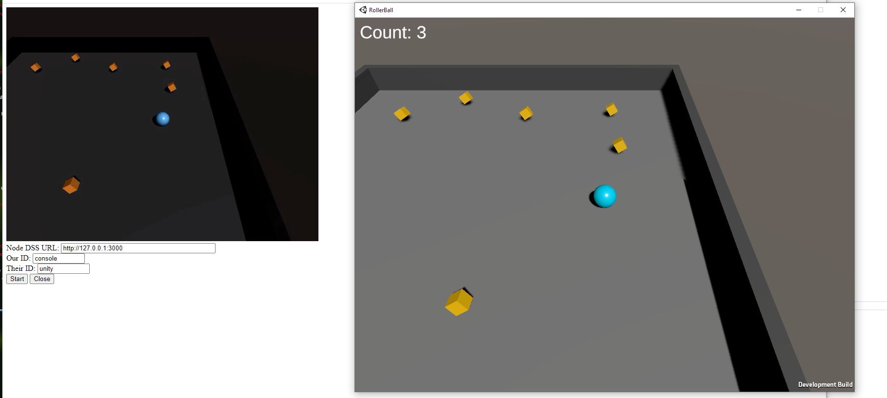

# Description

This example combines the [Roll-a-Ball](https://learn.unity.com/project/roll-a-ball) tutorial with the [Unity WebRTC package](https://github.com/Unity-Technologies/com.unity.webrtc).

It allows a Unity camera source to be transmitted over a WebRTC peer connection and viewed in a browser.

# Instructions

1. The example should already have the Unity WebRTC package installed but if not follow the [install instructions](https://github.com/Unity-Technologies/com.unity.webrtc/blob/develop/Documentation~/install.md).

2. Start the `node` signalling server which is contained in the root folder of this repository. The signalling server is used to communicate the WebRTC SDP offer/answer and ICE candidate messages between the peers (in this case Unity and a Browser).

  - Install [Node.js](https://nodejs.org/en/download/) if required,
  - Open a new console Window and navigate to the `node-dss` directory,
  - Install the `node` dependencies using `npm install`,
  - Start the server using `npm start`.

3. Open Unity and run the game. Once it's started a message should appear on the `node` console stating that a `POST` request was received.

4. Open the `webrtc-viewer.html` file in a WebRTC enabled browser (ideally Chrome) and press the `Start` button. Within a few seconds the video stream in the browser should appear showing the Unity video source.

